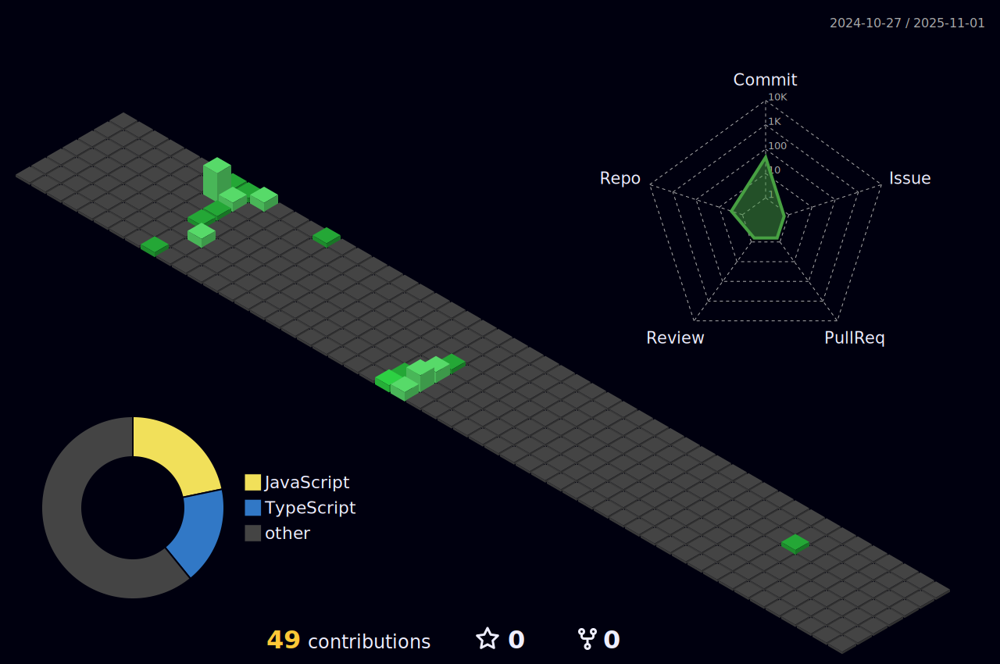

# Kanika

	<h1 align="center">
	    
	</h1>

<h3 align="center">

</h3>

 <h3 align="center"><strong> A Passionate Full Stack Web Developer  </strong> </h3>

  
<!-- ---- -->

  

- 💻 Software Developer at **Deutsche Bank** ✨🧿
- 🧠 Winner of Global Hackathon (NeuroCodes x Dementia UK) representing India 🇮🇳 at Deutsche Bank 🌐🏆
- 🔬 Previously interned at BARC and Deutsche Bank, gaining exposure to real-world tech and research 🧪
- 👩🏻‍🎓 BTech Graduate from SNDT Women's University Mumbai 🎓
- 📊 Built projects like Amazon Price Tracker, Facebook Friends Exporter, and YouTube Transcript Summarizer using Python & Selenium 🛠️
- 🌍 Actively building apps with React, Ionic, and exploring ways tech can support mental health & accessibility 💡💙
- ✍️ I love writing journals, editing videos, and turning ideas into digital experiences 🎥📘

<!-- ---- -->
 

 
  
  
  <a href="https://kanika11-portfolio.netlify.app">
      <!-- sqlite, safari, google-chrome are other good icon options -->
  </a>
  

 

 
<h2 align="center">⚒️ Languages-Frameworks-Tools ⚒️</h2>
 

    
     

 

<h3 align='center'><strong>Github Analytics ⚙️</strong></h3>

 

<markdown-accessiblity-table data-catalyst="">
  <table style="width: 100%; background-color: #1e1e1e; color: white; table-layout: fixed;">
    <thead>
		<tr>
		  <th colspan="2" align="center">
			   
		  </th>
		</tr>
      <tr>
        <th style="padding: 20px; text-align: center;">
          
        </th>
        <th style="padding: 20px; text-align: center;">
          
        </th>
      </tr>
    </thead>

  </table>
  

  <h2> 💻 My Contributions 💻 </h2>
    
   
    
     

  
</markdown-accessiblity-table>

<h2 align="center">⚡ Stats ⚡</h2>
 

  
  
   
  

<h1 align="center">
    
</h1>

